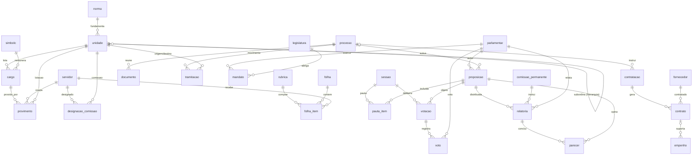

# Modelo de Dados — Sistema de Gestão da CMDC

Desenho do banco de dados de um sistema que atenda todos os setores da Câmara
Municipal de Duque de Caxias, com a **Lei nº 3.525/2025** como base normativa
obrigatória (estrutura, cargos e gratificações) e a **Lei nº 1.506/2000**
(Estatuto) para o regime de pessoal.

Implementação: `sistema/schema.sql` (SQL portável — SQLite para estudo,
PostgreSQL em produção) + `sistema/gerar_seed.py` (carga inicial gerada a
partir de `orgao/cmdc.py`) + `sistema/demo.py` (consultas de verificação).

## Módulos e entidades

### 1. Estrutura organizacional (`norma`, `unidade`)

- `unidade` guarda a árvore hierárquica (auto-relacionamento `unidade_pai_id`),
  o **grau funcional** da Lei 3.525/2025 (1–4; nulo para órgãos políticos) e o
  **tipo** (`POLITICO`, `SUPERIOR`, `COORDENADORIA`, `ASSESSORAMENTO`,
  `AUXILIAR`, `COMISSAO`).
- Campos `vigente_desde`/`vigente_ate` permitem versionar a estrutura no tempo
  (a reforma 2023 → 2025 mostrou que isso é requisito, não luxo).
- `norma` registra a base legal de cada unidade/cargo/rubrica.

### 2. Cargos, servidores e lotação (`simbolo`, `cargo`, `servidor`, `provimento`)

- `simbolo`: tabela do Anexo I (DAS-8, FC-1, FC-2, CAE-1, SL-1, PAR-*, GAB-*,
  ASS-*, SAS-6) com retribuição-base e natureza — símbolos `FC-*` são
  **funções de confiança** (só servidor efetivo), os demais, cargos em comissão.
- `cargo`: denominação, tipo (`EFETIVO`/`COMISSAO`/`FUNCAO_CONFIANCA`),
  quantidade de vagas (Anexo I: 615) e lotação padrão (dirigentes de unidade).
- `provimento`: histórico de ocupação (servidor × cargo × unidade × período),
  com o ato de nomeação. Vagas livres = quantidade do cargo − provimentos ativos.
- Regras do Estatuto a aplicar na camada de negócio: estágio probatório de 36
  meses, jornada de 30h, mínimo de 2 anos de efetivo exercício para função
  gratificada (Lei 3.525/2025, art. 5º, §3º).

### 3. Folha de pagamento (`rubrica`, `designacao_comissao`, `folha`, `folha_item`)

Rubricas pré-cadastradas com base legal e teto percentual:

| Código | Rubrica | Base legal | Percentual |
|---|---|---|---|
| GAL | Gratificação de Atividade Legislativa | Lei 3.525/2025, art. 7º | até 150% |
| REP-TL | Representação — Técnico Legislativo | art. 8º | 60% |
| GAP | Gratificação de Atividade Perigosa | art. 9º | 40% |
| REP-JUD | Adicional de Representação Judiciária | art. 10 | 40% |
| GRAT-COM | Gratificação de comissão (não incorporável) | arts. 46–47 | 40% |
| GRAT-CC | Gratificação de efetivo em cargo em comissão | art. 3º, §4º | 100% |
| ATS | Adicional por tempo de serviço (triênio) | art. 6º, §2º, III | por triênio |

- `designacao_comissao` controla quem integra cada comissão permanente ou
  temporária (art. 45) e alimenta a GRAT-COM — que só é paga **enquanto houver
  atuação efetiva** e tem **base de incidência escolhida pelo servidor**
  (art. 46, §3º): o campo `base_incidencia` registra a opção.
- `folha`/`folha_item`: competência mensal, valor = base × percentual, rubrica a
  rubrica — auditável contra a lei.
- Integração obrigatória com o **e-Social** (art. 48).

### 4. Protocolo e tramitação (`processo`, `documento`, `tramitacao`)

Núcleo de tudo: processos administrativos **e** legislativos recebem número
único por ano, reúnem documentos e tramitam entre unidades com despacho e
recebimento — cobre Secretaria-Geral, gabinetes e todas as coordenadorias.

### 5. Processo legislativo (`legislatura`, `parlamentar`, `mandato`, `proposicao`, `sessao`, `pauta_item`, `votacao`, `voto`)

Proposições (PL, PDL, PR, emendas, indicações…) vinculadas ao processo
autuado, pautadas em sessões, votadas de forma simbólica ou **nominal** (voto
individual por parlamentar). Compatível com os fluxos do SAPL/Interlegis,
permitindo integração futura.

### 5b. Comissões, relatoria e pareceres (`comissao_permanente`, `relatoria`, `parecer`)

Instrução da matéria nas comissões permanentes temáticas antes da
deliberação em Plenário (art. 33 e segs. do Regimento Interno). A
`relatoria` designa um relator (parlamentar) para a proposição numa
comissão, com prazo regimental; o `parecer` (favorável, com emendas,
contrário ou pela rejeição) é emitido e aprovado pelo colegiado. Regra de
negócio: matéria de mérito (PL, PLC, PDL, PR) só entra em Ordem do Dia com
parecer aprovado, **salvo regime de urgência**, e o parecer **não vincula**
o Plenário. Não confundir com as comissões *administrativas* do art. 45 da
Lei 3.525/2025 (essas ficam em `designacao_comissao`, módulo de folha).

O módulo de tramitação (§4) ganhou um campo **`prazo` (SLA)** por passagem:
`processos_em_atraso` lista processos cuja última tramitação segue sem
recebimento com prazo vencido.

### 6. Compras, contratos e execução (`fornecedor`, `contratacao`, `contrato`, `empenho`)

Contratações sob a Lei 14.133/2021 (modalidade, agente/comissão de
contratação), contratos e empenhos — atende Superintendência-Geral,
Coordenadorias de Compras, Licitações e Contratos, Contabilidade e Finanças.

### 7. Controle e transparência (`publicacao`, `auditoria`)

- `auditoria`: trilha imutável de operações (Controladoria-Geral).
- `publicacao`: o que foi publicado no portal da transparência, quando e onde
  (Coordenadoria de Publicações e Transparência / LAI).

## Decisões de projeto

1. **SQL portável**: sem tipos proprietários; roda hoje em SQLite (estudo,
   testes) e migra para PostgreSQL sem reescrita relevante.
2. **Estrutura versionada no tempo** em vez de sobrescrita — histórico
   organizacional é exigência de auditoria.
3. **Regras da lei como dados** (rubricas com teto percentual e base legal),
   não como código espalhado: mudou a lei, muda-se o cadastro.
4. **Seed derivado do modelo de domínio** (`orgao/cmdc.py`): uma única fonte
   de verdade para a estrutura da Lei 3.525/2025.
